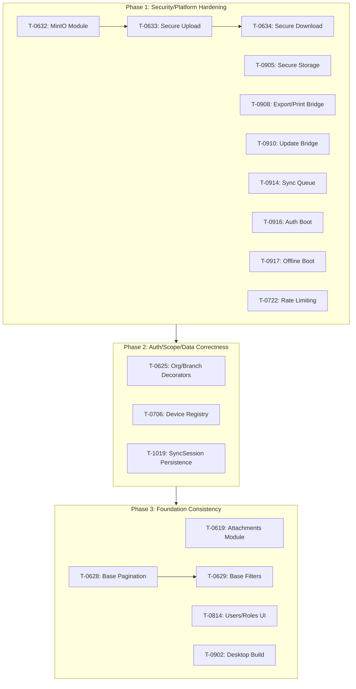

# Pending Remediation Executor - Execution Plan

## Overview

Systematic execution plan for processing 18 bugs from
`pending-remediation-matrix.csv` using the `pending-remediation-executor` skill.

## Execution Order

```
Security/Platform Hardening (10 bugs)
    ↓
Auth/Scope/Data Correctness (3 bugs)
    ↓
Foundation Consistency/UX Debt (5 bugs)
```

---

## Phase 1: Security/Platform Hardening (10 bugs)

### Batch 1A: MinIO Infrastructure (3 bugs - sequential dependency)

```
T-0632 → T-0633 → T-0634
```

| Step | Task ID | Title                                    | App | Source File                                                                     |
| ---- | ------- | ---------------------------------------- | --- | ------------------------------------------------------------------------------- |
| 1.1  | T-0632  | Configurar módulo de archivos con MinIO  | API | docs/07-dev-workflow/tasks/fase-06-bloque-07/T-0632-modulo-archivos-minio.md    |
| 1.2  | T-0633  | Configurar subida segura de archivos     | API | docs/07-dev-workflow/tasks/fase-06-bloque-07/T-0633-subida-segura-archivos.md   |
| 1.3  | T-0634  | Configurar descargas seguras de archivos | API | docs/07-dev-workflow/tasks/fase-06-bloque-07/T-0634-descarga-segura-archivos.md |

**Strategy**: Infrastructure layer configuration

- Check `apps/api/src/modules/storage/` or create if missing
- Validate env vars: `MINIO_ENDPOINT`, `MINIO_ACCESS_KEY`, `MINIO_SECRET_KEY`,
  `MINIO_BUCKET`
- Use Prisma service layer pattern with repository pattern
- **Validation**: `pnpm --filter=@atlaserp/api lint && typecheck && build`

### Batch 1B: Desktop Security (6 bugs - parallel independent)

```
T-0905, T-0908, T-0910, T-0914, T-0916, T-0917
```

| Step | Task ID | Title                                             | App     | Source File                                                                           |
| ---- | ------- | ------------------------------------------------- | ------- | ------------------------------------------------------------------------------------- |
| 1.4  | T-0905  | Configurar almacenamiento local seguro            | Desktop | docs/07-dev-workflow/tasks/fase-09-bloque-02/T-0905-almacenamiento-local-seguro.md    |
| 1.5  | T-0908  | Configurar bridge de impresión/exportación        | Desktop | docs/07-dev-workflow/tasks/fase-09-bloque-02/T-0908-bridge-impresion-exportacion.md   |
| 1.6  | T-0910  | Configurar bridge de actualizaciones futuras      | Desktop | docs/07-dev-workflow/tasks/fase-09-bloque-03/T-0910-bridge-actualizaciones-futuras.md |
| 1.7  | T-0914  | Configurar repositorios locales para cola de sync | Desktop | docs/07-dev-workflow/tasks/fase-09-bloque-03/T-0914-repositorios-locales-cola-sync.md |
| 1.8  | T-0916  | Configurar arranque desktop autenticado           | Desktop | docs/07-dev-workflow/tasks/fase-09-bloque-04/T-0916-arranque-desktop-autenticado.md   |
| 1.9  | T-0917  | Configurar arranque desktop offline               | Desktop | docs/07-dev-workflow/tasks/fase-09-bloque-04/T-0917-arranque-desktop-offline.md       |

**Strategies**:

- T-0905: Rust commands in `apps/desktop/src-tauri/src/commands.rs` with OS
  keychain
- T-0908: Tauri command registration for CSV/JSON export
- T-0910: Contract definition only (state + check-updates)
- T-0914: Local SQLite repository with state transitions
- T-0916/T-0917: Session detection + offline-first boot flow
- **Validation**: `pnpm --filter=@atlaserp/desktop lint`

### Batch 1C: API Rate Limiting (1 bug)

```
T-0722
```

| Step | Task ID | Title                                       | App | Source File                                                             |
| ---- | ------- | ------------------------------------------- | --- | ----------------------------------------------------------------------- |
| 1.10 | T-0722  | Rate limiting en endpoints de autenticación | API | docs/07-dev-workflow/tasks/fase-07-bloque-05/T-0722-rate-limit-guard.md |

**Strategy**: Custom in-memory guard

- Implement using Map with TTL (not @nestjs/throttler)
- Create `@RateLimit()` decorator
- Register as APP_GUARD
- **Validation**: `pnpm --filter=@atlaserp/api lint && typecheck && build`

---

## Phase 2: Auth/Scope/Data Correctness (3 bugs)

### Batch 2A: API Auth Decorators (3 bugs - some dependencies)

| Step | Task ID | Title                                           | App | Source File                                                                             | Dependency            |
| ---- | ------- | ----------------------------------------------- | --- | --------------------------------------------------------------------------------------- | --------------------- |
| 2.1  | T-0625  | Configurar decorators de organización/sucursal  | API | docs/07-dev-workflow/tasks/fase-06-bloque-06/T-0625-decorators-organizacion-sucursal.md | T-0624 must be closed |
| 2.2  | T-0706  | Implementar registro de devices                 | API | docs/07-dev-workflow/tasks/fase-07-bloque-02/T-0706-registro-devices.md                 | T-0705 must be closed |
| 2.3  | T-1019  | Implementar persistencia backend de SyncSession | API | docs/07-dev-workflow/tasks/fase-10-bloque-04/T-1019-persistencia-sync-session.md        | None                  |

**Strategies**:

- T-0625: Custom decorators in `apps/api/src/common/decorators/` with
  `@CurrentOrganization()` and `@CurrentBranch()`
- T-0706: Extend DeviceRegistry model, enrich GET /v1/sessions with
  userAgent/ipAddress
- T-1019: Modify `SyncService.processBatch()`, ensure counters + audit via
  `auditAction()`
- **Validation**: `pnpm --filter=@atlaserp/api lint && typecheck && build`

---

## Phase 3: Foundation Consistency/UX Debt (5 bugs)

### Batch 3A: API Foundation (3 bugs - sequential dependency)

| Step | Task ID | Title                         | App | Source File                                                               | Dependency            |
| ---- | ------- | ----------------------------- | --- | ------------------------------------------------------------------------- | --------------------- |
| 3.1  | T-0619  | Configurar módulo Attachments | API | docs/07-dev-workflow/tasks/fase-06-bloque-04/T-0619-modulo-attachments.md | T-0618 must be closed |
| 3.2  | T-0628  | Configurar paginación base    | API | docs/07-dev-workflow/tasks/fase-06-bloque-06/T-0628-paginacion-base.md    | T-0627 must be closed |
| 3.3  | T-0629  | Configurar filtros base       | API | docs/07-dev-workflow/tasks/fase-06-bloque-06/T-0629-filtros-base.md       | T-0628 must be closed |

**Strategies**:

- T-0619: Create attachments module with Prisma service layer, DTOs with
  class-validator
- T-0628: Reusable pagination layer in common, apply to SyncModule first
- T-0629: DTO + utilities in common layer, apply to 3+ services
- **Validation**: `pnpm --filter=@atlaserp/api lint && typecheck && build`

### Batch 3B: Frontend/Web (1 bug)

| Step | Task ID | Title                                        | App | Source File                                                             |
| ---- | ------- | -------------------------------------------- | --- | ----------------------------------------------------------------------- |
| 3.4  | T-0814  | Configurar módulo visual de users/roles base | Web | docs/07-dev-workflow/tasks/fase-08-bloque-03/T-0814-users-roles-base.md |

**Strategy**: React table with real backend data

- Use existing API endpoints for users/roles
- Handle loading/error/empty states
- Radix UI + TailwindCSS 4.1 (no Bootstrap)
- **Validation**: `pnpm --filter=@atlaserp/web lint && build`

### Batch 3C: Desktop Build (1 bug)

| Step | Task ID | Title                          | App     | Source File                                                                |
| ---- | ------- | ------------------------------ | ------- | -------------------------------------------------------------------------- |
| 3.5  | T-0902  | Configurar build local desktop | Desktop | docs/07-dev-workflow/tasks/fase-09-bloque-01/T-0902-build-local-desktop.md |

**Strategy**: Tauri build commands

- `pnpm --filter=@atlaserp/desktop build:web` for embedded web
- `pnpm --filter=@atlaserp/desktop build` for Tauri packaging
- Note: Requires Rust toolchain (cargo)
- **Validation**: `pnpm --filter=@atlaserp/desktop lint`

---

## Execution Flow Diagram



---

## Status Update Pattern

### CSV Updates

```csv
# Before (starting)
status: OPEN → IN_PROGRESS
last_updated: 2026-04-21

# After (completing)
status: IN_PROGRESS → COMPLETED
last_updated: 2026-04-21
```

### Master.md Updates

Add to resolution notes column:

```
Completed: 2026-04-21 - [brief resolution summary]
```

---

## Validation Checklist Per Bug

| Check     | Command                                 | Success Criteria   |
| --------- | --------------------------------------- | ------------------ |
| Lint      | `pnpm --filter=@atlaserp/<app> lint`    | Exit 0             |
| Typecheck | `pnpm --filter=@atlaserp/api typecheck` | Exit 0 (API only)  |
| Build     | `pnpm --filter=@atlaserp/<app> build`   | Exit 0             |
| UTF-8     | `file --mime-encoding <file>`           | UTF-8              |
| Status    | Update CSV                              | Status = COMPLETED |

---

## Safeguards

### Dependency Checks

Before processing each bug, verify dependencies are CLOSED:

- T-0632 before T-0633, T-0634
- T-0628 before T-0629
- T-0618 before T-0619
- T-0624 before T-0625
- T-0705 before T-0706

### If Dependency Unmet

```
⚠️ SKIPPED: T-XXXX depends on T-YYYY which is not CLOSED
→ Continue to next independent task
→ Log in remediation report
```

### Idempotency

Before processing:

1. Read CSV status
2. If status = COMPLETED, skip
3. If status = IN_PROGRESS, check if previous run crashed - decide whether to
   resume or skip

---

## Final Report Template

```
# Pending Remediation Execution Report
Date: [ISO 8601]
Total Bugs: 18

## Completed: [N]
| Task ID | Title | Resolution | Files Modified |
|---------|-------|-----------|---------------|

## Skipped (Dependencies): [N]
| Task ID | Reason | Blocker |
|---------|--------|---------|

## Failed: [N]
| Task ID | Error | Notes |
|---------|-------|-------|

## Remaining: [N]
| Task ID | Title | Next Action |
|---------|-------|------------|
```

---

## Next Steps After Completion

1. Run full test suite: `pnpm test`
2. Update `pending-remediation-master.md` audit section
3. Archive completed tasks documentation
4. Create follow-up tasks for deferred items (antivirus scan, Redis rate
   limiting, etc.)

