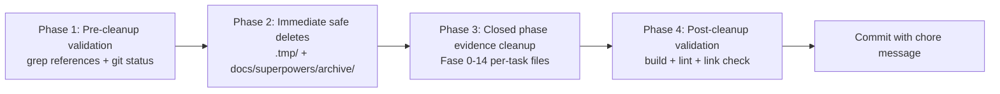

# Plan: Repository Cleanup — Identifying and Removing Non‑Essential Files

## Context and Objective

AtlasERP has been built across 14+ phases with extensive task-level
documentation, status tracking, and execution artifacts. Many of these are now
permanently historical — their phases are fully closed, tasks are CERRADA, and
the information has been consolidated into status boards. This plan defines how
to systematically identify and remove or archive non-essential files while
preserving what is needed for audit, traceability, and ongoing development.

---

## 1. Trash Classification Criteria

### 1.1 Categories of Non‑Essential Files

| Category                                | Description                                                                                                        | Examples                                                                                         |
| --------------------------------------- | ------------------------------------------------------------------------------------------------------------------ | ------------------------------------------------------------------------------------------------ |
| **T1: Temporary Dev Artifacts**         | Runtime logs and dev scripts output                                                                                | `.tmp/*.log`, `dev-*.log`, `reset-*.log`                                                         |
| **T2: Completed Phase Execution Plans** | Old sprint/phase execution runbooks that are no longer active                                                      | `docs/superpowers/plans/*.md`                                                                    |
| **T3: Redundant Task Evidence**         | Individual task-detail markdown files for phases that are fully closed and already have consolidated status boards | `docs/07-dev-workflow/tasks/fase-XX-bloque-XX/*.md` where phase is fully CERRADA                 |
| **T4: Obsolete Plans**                  | Standalone plan files for completed/merged initiatives                                                             | `plans/beta-finish-gap-checklist.md`, `plans/module-store-installer-roadmap.md`                  |
| **T5: Stale Audit/Artifacts**           | One-time audit outputs whose findings have been addressed                                                          | `docs/07-dev-workflow/auditoria-integridad-repo-2026-04-14.md` (date-stamped, findings resolved) |
| **T6: Generated Duplicates**            | Files that are programmatically generated and checked in but should be in `.gitignore`                             | Any `.log`, `.cache`, `.tmp` that slipped through                                                |
| **T7: Outdated Debug Guides**           | Guides tied to specific past incidents                                                                             | `docs/07-dev-workflow/defectos-fase-17.md`                                                       |

### 1.2 Files That Are NOT Trash

| Category                                                                  | Reason to Keep                                      |
| ------------------------------------------------------------------------- | --------------------------------------------------- |
| Task block status files (`task-block-*.md`)                               | Active operational reference; show closure evidence |
| Master catalog (`business-platform-master-task-catalog.md`)               | Single source of truth for all task IDs and phases  |
| `pending-remediation-*.md/csv`                                            | Active remediation work                             |
| `task-pending-registry.md`, `task-index.md`, `task-dependency-map.md`     | Active operational meta-documents                   |
| `docs/00-canon/`, `docs/01-product/`, `docs/04-modules/`, `docs/05-sync/` | Canonical reference docs                            |
| `.github/workflows/`                                                      | CI/CD configuration                                 |
| `prisma/migrations/`                                                      | Versioned schema history                            |
| `packages/sync-contracts/`                                                | Active sync logic                                   |

---

## 2. Immediate Cleanup (Pre‑flight)

### 2.1 `.tmp/` Directory — 6 files

```
.tmp/dev-reset.out.log
.tmp/dev-reset.err.log
.tmp/dev.out.log
.tmp/dev.err.log
.tmp/devall.out.log
.tmp/devall.err.log
```

**Action**: Delete all 6 files. These are dev runtime outputs. Add `*.log` to
`.tmp/.gitignore` if not already present.

### 2.2 `docs/superpowers/plans/` — 2 files

```
docs/superpowers/plans/2026-04-18-fase-17-22-execution.md
docs/superpowers/plans/2026-04-19-accounting-core-fase-23.md
```

**Action**: These are phase execution runbooks for phases 17 and 23 which are
historical. Move to `docs/superpowers/archive/` or delete if no rollback
information is needed. Verify no open references to these paths before deletion.

### 2.3 Stale/Superseded Plan Files

```
plans/beta-finish-gap-checklist.md          # Beta closure artifact, superseding plan
plans/module-store-installer-roadmap.md     # Module store now in production
```

**Action**: Review each — if the initiative is complete and the file is not
referenced from any active document, move to `plans/archive/` or delete.

---

## 3. Phase Evidence Cleanup — Risk Assessment

The `docs/07-dev-workflow/tasks/` directory contains per-task markdown evidence
files for every phase. Many phases are fully closed.

### 3.1 Closure Status by Phase

| Phase         | Blocks             | Status | Evidence Subfolders                               | Risk if Removed                            |
| ------------- | ------------------ | ------ | ------------------------------------------------- | ------------------------------------------ |
| Fase 0        | 10 blocks (00–09)  | CLOSED | `fase-00-bloque-01/` through `fase-00-bloque-10/` | **LOW** — consolidated status boards exist |
| Fase 1        | 10 blocks (10–19)  | CLOSED | `fase-01-bloque-01/` through `fase-01-bloque-10/` | **LOW**                                    |
| Fase 2        | 9 blocks (20–28)   | CLOSED | `fase-02-bloque-01/` through `fase-02-bloque-09/` | **LOW**                                    |
| Fase 3        | 9 blocks (29–37)   | CLOSED | `fase-03-bloque-01/` through `fase-03-bloque-09/` | **LOW**                                    |
| Fase 4        | 1 block (38)       | CLOSED | `fase-04-bloque-01/`                              | **LOW**                                    |
| Fase 5        | 8 blocks (39–46)   | CLOSED | `fase-05-bloque-01/` through `fase-05-bloque-08/` | **LOW**                                    |
| Fase 6        | 10 blocks (47–56)  | CLOSED | `fase-06-bloque-01/` through `fase-06-bloque-10/` | **LOW**                                    |
| Fase 7        | 6 blocks (57–62)   | CLOSED | `fase-07-bloque-01/` through `fase-07-bloque-06/` | **LOW**                                    |
| Fase 8        | 9 blocks (63–71)   | CLOSED | `fase-08-bloque-01/` through `fase-08-bloque-09/` | **LOW**                                    |
| Fase 9        | 5 blocks (72–76)   | CLOSED | `fase-09-bloque-01/` through `fase-09-bloque-05/` | **LOW**                                    |
| Fase 10       | 10 blocks (77–87)  | CLOSED | `fase-10-bloque-01/` through `fase-10-bloque-10/` | **LOW**                                    |
| Fase 11       | 3 blocks (101–103) | CLOSED | `fase-11-bloque-01/` through `fase-11-bloque-03/` | **LOW**                                    |
| Fase 12       | 5 blocks (88–92)   | CLOSED | `fase-12-bloque-01/` through `fase-12-bloque-05/` | **LOW**                                    |
| Fase 13       | 8 blocks (93–100)  | CLOSED | `fase-13-bloque-01/` through `fase-13-bloque-08/` | **LOW**                                    |
| Fase 14       | 6 blocks (104–109) | CLOSED | `fase-14-bloque-01/` through `fase-14-bloque-06/` | **LOW**                                    |
| Active phases | 15+                | OPEN   | `fase-15+`, `fase-16+`, etc.                      | **DO NOT TOUCH**                           |

**Total closed evidence subfolders**: ~93 directories containing thousands of
individual task markdown files.

### 3.2 Recommended Strategy for Evidence Files

**Option A — Conservative (recommended for first pass)**: Keep all evidence, but
delete only the individual task markdown files that contain only "CERRADA"
status with no unique technical content. The block status files already provide
closure evidence.

**Option B — Aggressive**: Consolidate each closed phase's evidence into a
single `fase-XX-closure-archive.md` file containing links to what matters, then
delete the per-task files.

**Option C — Move to archive**: Move all closed-phase evidence folders to
`docs/07-dev-workflow/tasks/archive/` leaving the folder structure but making it
clear these are historical.

---

## 4. Step‑by‑Step Deletion/Archival Process

### Phase 1: Pre‑cleanup Validation

```bash
# 1. Verify no open references to .tmp log files
grep -r "dev-reset.out.log\|dev-reset.err.log\|dev.out.log\|dev.err.log" --include="*.md" --include="*.ts" --include="*.js" .

# 2. Verify no open references to docs/superpowers/plans/ old files
grep -r "2026-04-18-fase-17-22\|2026-04-19-accounting-core-fase-23" --include="*.md" .

# 3. Check git status for any uncommitted changes in target directories
git status docs/07-dev-workflow/tasks/ plans/ .tmp/ docs/superpowers/
```

### Phase 2: Immediate Safe Deletes

1. **Delete `.tmp/` log files**

   ```bash
   rm .tmp/dev-reset.out.log .tmp/dev-reset.err.log .tmp/dev.out.log .tmp/dev.err.log .tmp/devall.out.log .tmp/devall.err.log
   ```

2. **Archive `docs/superpowers/plans/` old files**

   ```bash
   mkdir -p docs/superpowers/archive
   mv docs/superpowers/plans/2026-04-18-fase-17-22-execution.md docs/superpowers/archive/
   mv docs/superpowers/plans/2026-04-19-accounting-core-fase-23.md docs/superpowers/archive/
   ```

3. **Review and archive stale plans**
   ```bash
   # Move beta-finish-gap-checklist.md and module-store-installer-roadmap.md to plans/archive/
   mkdir -p plans/archive
   # Review each, then move if unreferenced
   ```

### Phase 3: Evidence Cleanup (Closed Phases)

For each fully-closed phase (Fase 0 through Fase 14):

1. Verify phase is marked COMPLETA/CERRADA in
   `business-platform-master-task-catalog.md`
2. Confirm no open tasks in `task-pending-registry.md` for that phase
3. Check that `task-block-XX-status.md` exists and shows CLOSED for all blocks
4. Delete per-task markdown files, keeping only the block status file as closure
   evidence

```bash
# Example for Fase 0 (blocks 01-10)
# Keep: task-block-00-status.md through task-block-09-status.md
# Delete: docs/07-dev-workflow/tasks/fase-00-bloque-01/*.md (per-task files only)
```

### Phase 4: Post‑Cleanup Validation

```bash
# Verify project still builds
pnpm --filter=@atlaserp/api build
pnpm --filter=@atlaserp/web build
pnpm --filter=@atlaserp/desktop build

# Verify lint passes
pnpm lint
pnpm --filter=@atlaserp/api typecheck

# Verify no orphaned markdown links
# Check docs/07-dev-workflow/README.md index still matches available files
```

---

## 5. Version‑Control History Handling

### 5.1 Git Considerations

**Do NOT rewrite git history** (`git filter-branch`, `git rebase -i`) for
already-shared commits. This breaks the repo for anyone who pulled based on
those commits.

**Instead:**

- Remove files from current state only (no history rewrite)
- The deleted files will show as "deleted" in `git status` and in future diffs —
  this is normal and fine
- Commit the deletion as a single `chore: remove non-essential artifacts` commit

### 5.2 What Goes Into the Commit Message

```
chore: remove non-essential development artifacts

- Delete 6 temporary log files from .tmp/ (dev runtime output)
- Archive old phase execution plans from docs/superpowers/plans/
- Remove per-task evidence markdown files for closed phases (Fase 0-14)
  as closure evidence is consolidated in task-block-*-status.md files
- Move stale plan files to plans/archive/

Affected paths:
  .tmp/
  docs/superpowers/plans/ -> docs/superpowers/archive/
  docs/07-dev-workflow/tasks/fase-00-bloque-01/ through fase-14-bloque-06/
  plans/beta-finish-gap-checklist.md -> plans/archive/
  plans/module-store-installer-roadmap.md -> plans/archive/
```

### 5.3 If History Rewriting Is Strictly Necessary (Emergency)

Only if a file contains **secrets or sensitive data** (not just "trash"):

```bash
# WARNING: rewrites shared history — only for secrets/credentials
git filter-branch --tree-filter 'rm -f path/to/file' HEAD -- --prune-empty
```

Document the rewrite in the commit message and notify all collaborators to
re-clone.

---

## 6. Ongoing Maintenance Guidelines

### 6.1 Definition of "Done" for a Phase

When a phase is declared COMPLETA:

1. All `task-block-XX-status.md` files for that phase must exist and show CLOSED
   status with dates
2. The master catalog (`business-platform-master-task-catalog.md`) must show the
   phase as CERRADA
3. **Then**: trigger evidence cleanup within 7 days

### 6.2 Recurring Cleanup Schedule

| Cadence            | Action                                                                              |
| ------------------ | ----------------------------------------------------------------------------------- |
| **On phase close** | Execute evidence cleanup for that phase (per-task files → archive or delete)        |
| **Monthly**        | Review `.tmp/`, `plans/archive/`, `docs/superpowers/archive/` for accumulated files |
| **Quarterly**      | Review open tabs and stale docs referenced in `docs/07-dev-workflow/README.md`      |
| **Pre‑release**    | Final sweep of any temporary files before tagging                                   |

### 6.3 File Retention Rules

| File Type                                             | Retention                                              |
| ----------------------------------------------------- | ------------------------------------------------------ |
| Task block status (`task-block-*.md`)                 | **Permanent** — operational reference                  |
| Per-task evidence (`T-XXXX-*.md` in `tasks/`)         | **Until phase closure**, then archive or delete        |
| Phase execution plans (`docs/superpowers/plans/*.md`) | **30 days post-phase-close**, then `archive/`          |
| Temporary dev logs (`.tmp/`)                          | **Never commit** — already in `.gitignore`             |
| Debug guides for past incidents                       | **30 days post-resolution**, then evaluate             |
| Audit artifacts (`auditoria-*.md`, `artifacts/*.md`)  | **Review at each phase close** — keep if findings open |

### 6.4 .gitignore Enforcement

Ensure the following patterns are in `.gitignore`:

```
.tmp/
*.log
*.log.*
logs/
```

If not present, add them before committing cleanup to prevent re-introduction.

### 6.5 Pre‑commit Hook

Consider adding a pre-commit hook that:

- Warns if `.tmp/` or `*.log` files are being committed
- Fails the commit if any file > 5MB is being added to
  `docs/07-dev-workflow/tasks/`

---

## 7. Execution Summary



| Step | What                              | Risk                                                                   |
| ---- | --------------------------------- | ---------------------------------------------------------------------- |
| 1    | Pre-cleanup grep/validate         | No risk                                                                |
| 2    | Delete `.tmp/` logs               | No risk — these are dev output files                                   |
| 3    | Archive `docs/superpowers/plans/` | No risk — moved, not deleted                                           |
| 4    | Review and archive stale plans    | Low risk — review before moving                                        |
| 5    | Evidence cleanup (Fase 0-14)      | Medium risk — verify closure status before deleting any per-task files |
| 6    | Post-cleanup build/lint           | No risk — validates nothing broke                                      |

---

## 8. Files to Act On — Consolidated Checklist

### Delete Immediately (no review needed)

- [ ] `.tmp/dev-reset.out.log`
- [ ] `.tmp/dev-reset.err.log`
- [ ] `.tmp/dev.out.log`
- [ ] `.tmp/dev.err.log`
- [ ] `.tmp/devall.out.log`
- [ ] `.tmp/devall.err.log`

### Archive (review then move)

- [ ] `docs/superpowers/plans/2026-04-18-fase-17-22-execution.md` →
      `docs/superpowers/archive/`
- [ ] `docs/superpowers/plans/2026-04-19-accounting-core-fase-23.md` →
      `docs/superpowers/archive/`
- [ ] `plans/beta-finish-gap-checklist.md` → `plans/archive/` (review first)
- [ ] `plans/module-store-installer-roadmap.md` → `plans/archive/` (review
      first)

### Evidence Cleanup (verify closure before acting)

- [ ] Fase 0 evidence (`fase-00-bloque-01/` through `fase-00-bloque-10/`) —
      per-task .md files only
- [ ] Fase 1 evidence through Fase 14 evidence — same pattern

### Files to Keep Intact (DO NOT TOUCH)

- All `task-block-*.md` status files
- `business-platform-master-task-catalog.md`
- `docs/00-canon/`, `docs/01-product/`, `docs/04-modules/`, `docs/05-sync/`
- `docs/07-dev-workflow/` meta-docs: `task-pending-registry.md`,
  `task-index.md`, `task-dependency-map.md`
- `docs/07-dev-workflow/pending-remediation-*.md/csv`
- `prisma/migrations/`
- `packages/sync-contracts/`
- `.github/workflows/`

---

## 9. Questions for Validation

Before proceeding to execution, clarify:

1. **Evidence cleanup depth**: Should per-task evidence files for closed phases
   be deleted entirely, or moved to an archive folder?
2. **Plan file review**: Who should approve the decision to archive
   `beta-finish-gap-checklist.md` and `module-store-installer-roadmap.md`?
3. **Git history**: Confirm that no collaborators are working off historical
   commits that reference the paths being removed — standard practice is to just
   delete from current state (no history rewrite).

Once these are answered, the plan is ready for execution via Code mode.
